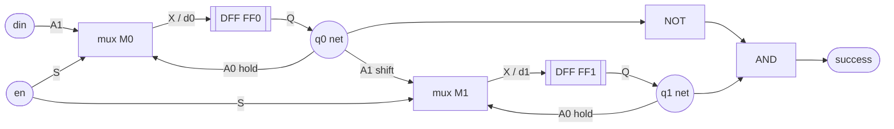

# Solving the toy netlist as a glass box

The toy is deliberately redundant: every stage below is run even when the
answer is already obvious. That is the point—it rehearses the same operations
needed for the full puzzle.

## 1. Start with only nets and terminals

The source is `tests/fixtures/toy_nets.json`. A JSON key is an electrical net;
each list contains the standard-cell pins touching that net. For example:

```text
din       -> M0_mux2.A1
('toy',1) -> FF0_dfrtp.Q, M0_mux2.A0, M1_mux2.A1, INV0_inv.A
success   -> AND0_and2.X
```

At this point there are no gate-to-gate edges. A net is a shared junction that
may connect one driver to many loads.

## 2. Recover instances and pin directions

`M0_mux2.A1` means instance `M0_mux2`,  
cell type `mux2`, pin `A1`. The cell type definition says that `A0`,  
`A1`, and `S` are inputs and `X` is an output. Doing this for all the pins connected  
to each net allows us to identify drivers and loads




Generate the same primitive graph from the code:

```bash
.venv/bin/python -m tools.analyze_netlist \
  tests/fixtures/toy_nets.json shift-chains \
  --dot docs/diagrams/toy-shift-chain.dot
dot -Tsvg docs/diagrams/toy-shift-chain.dot \
  -o docs/diagrams/toy-shift-chain.svg
```


## 3. Translate each cell into an equation

The Boolean functions now come from the official Sky130 Liberty snapshot:

```text
d0      = (!en & q0) | (en & din)
d1      = (!en & q1) | (en & q0)
success = q1 & !q0
```

## 4. Construct the one-clock transition relation

A transition relation is a function of current state and current inputs:

```text
T(q0, q1, din, en, rst_n) = (q0_next, q1_next)

if !rst_n: q0_next = 0;  q1_next = 0
else:      q0_next = d0; q1_next = d1
```

The word “relation” becomes useful later in SAT because the same statement can
be encoded as constraints instead of executed as Python. Conceptually it is
still just one simultaneous clock update. Both right-hand sides use **old**
`q0` and `q1`.

## 5. Evaluate the output at every current state

Even this tiny truth table exercises the generic combinational evaluator:


| q1  | q0  | success = q1 & !q0 |
| --- | --- | ------------------ |
| 0   | 0   | 0                  |
| 0   | 1   | 0                  |
| 1   | 0   | 1                  |
| 1   | 1   | 0                  |


The evaluator recursively asks for the driver of `success`, evaluates the AND,
asks for its input nets, evaluates the inverter where necessary, and stops at
the supplied Q-state values. Results are memoized so a shared net is computed
once per assignment.

## 6. Play several clock edges forward

```bash
.venv/bin/python -m tools.simulate_netlist \
  tests/fixtures/toy_nets.json \
  --input din=1,0,1,1 --input en=1 --input rst_n=1 \
  --watch FF0_dfrtp.Q --watch FF1_dfrtp.Q --watch success
```

The trace is:

```text
edge 1: q0 0->1, q1 0->0, success 0->0
edge 2: q0 1->0, q1 0->1, success 0->1
edge 3: q0 0->1, q1 1->0, success 1->0
edge 4: q0 1->1, q1 0->1, success 0->0
```


## 7. Recognize and verify the abstraction

Only now collapse the two mux/DFF pairs into `ShiftRegister[2]`. Recognition
checks the exact D connection, self-hold input, serial edge, common enable,
buffer-normalized clock source, reset, lack of branching, and unexpected
internal loads. The original graph remains available underneath the view.

## 8. Scale the same operations

For the warm-up, replace two state bits by two 8-bit groups and evaluate the
larger output cone. For the puzzle, first partition the 92 Q nets by their
next-state cones and shared controls. The mechanics—resolve a net, find its
driver, evaluate a cell, stop at state, update all Qs simultaneously—do not
change with design size. Exhaustive enumeration stops scaling; the transition
relation itself does not. SAT/BDD techniques change how assignments are
searched, not what the circuit means.