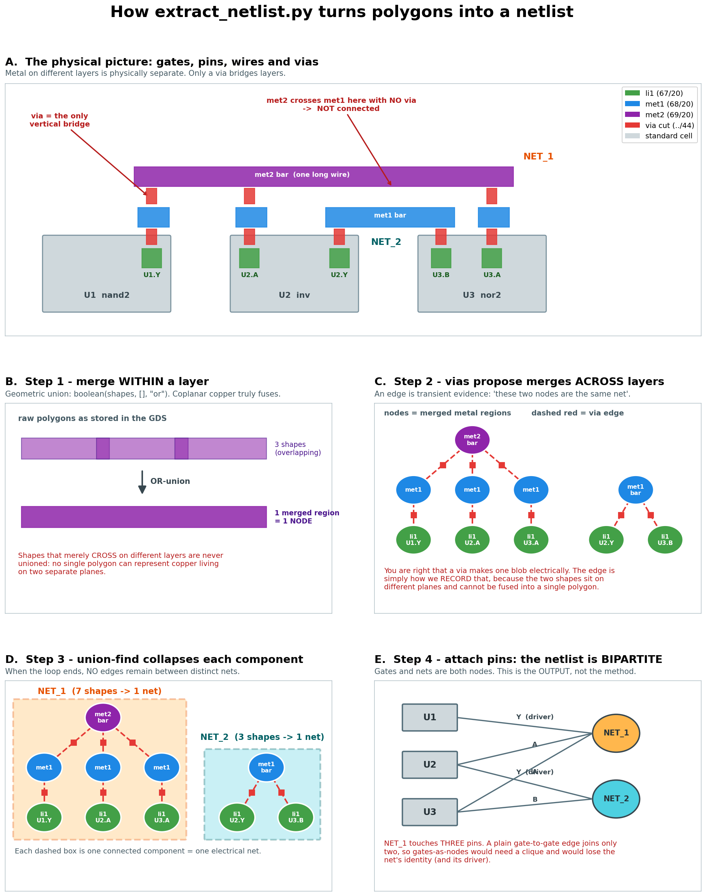

# From GDS geometry to circuit meaning

This workflow deliberately separates facts from interpretations. A mistake in
one layer should be visible before it silently contaminates the next.



## 1. Inventory the layout

A GDS is hierarchical geometry, not a circuit netlist. The top cell contains
references to standard cells, fillers, tap cells, via cells, and routing. A
standard-cell reference supplies two things we need:

- its cell type, such as `mux2_1` or `dfrtp_2`;
- transformed pin labels, such as `A0`, `X`, `D`, and `Q`.

Filler, tap, diode, and decap instances are excluded from the logical instance
list. Their conductor geometry remains present, because it can participate in
power connectivity.

## 2. Recover electrical nets from geometry

For each conductor layer (`li1`, `met1`, ..., `met5`), boolean-union all drawing
polygons. Each disjoint result is one connected region on that layer.

Then make every region a union-find node. For each via cut, find the conductor
region immediately below and above it and union those nodes:

```text
met2 region 17 -- via2 cut -- met3 region 4
        \___________________________/
                 one net
```

Finally, attach each transformed cell-pin label and top-level port label to the
region containing its point. Cell pins in the same union-find set are on the
same electrical net.

The extractor records checks that matter:

- every signal pin label resolves to a conductor region;
- every top-level port label resolves;
- a pin label does not touch multiple disconnected nets;
- a top-level alias does not name multiple nets;
- every via cut reports whether both adjacent conductors were found.

The checked-in warm-up snapshot has no unresolved pins or ports, and every via
cut is stitched. The full puzzle currently has the same clean geometric
diagnostics.

### Assumptions worth keeping visible

The Sky130 layer/datatype map is hard-coded and is technology-specific. Via
stitching uses the cut center; that is valid for these design-rule-clean files,
and the all-cuts-stitched diagnostic is important evidence, but this is not a
general-purpose LVS extractor. Pin identity also relies on the labels preserved
inside standard-cell references.

## 3. Build a typed graph

The extraction JSON contains explicit net IDs, optional top-level aliases, and
terminal names. `Design.load` turns it into:

```text
Design
  Instance U7_mux2_1
    A0 -> net n0012 (input)
    A1 -> net A     (input)
    S  -> net en    (input)
    X  -> net n0008 (output)
  Net n0008
    driver: U7_mux2_1.X
    load:   U12_dfrtp_2.D
```

Cell models supply pin directions, roles, and Boolean functions imported from
the official Sky130-HD Liberty data. From that information the graph derives
drivers, loads, top-level directions, combinational cones, and state boundaries.
Unknown cells and pins stay visible as validation issues; they are never
silently dropped.

## 4. Recognize motifs conservatively

An enable implemented as a mux before a D flip-flop has the equation

```text
D = select ? new_data : Q
```

When multiple such stages feed one another, they may be a shift register. The
strict recognizer accepts a group only if all of these structural claims hold:

- each mux output connects point-to-point to one flip-flop D;
- exactly one mux input is that stage's own Q (the hold path);
- the other input comes from the previous stage, except at the serial head;
- the chain is multi-stage, unbranched, and acyclic;
- all stages have the same clock, reset, enable, and mux orientation;
- internal Q loads match only the expected hold and shift edges.

External Q loads are recorded as parallel taps. The abstraction is a view over
the original cells, not a destructive rewrite, so every claim remains
inspectable.

This strictness is intentionally **sound but incomplete**: failing recognition
does not prove that a circuit is not a shift register. Synthesis may implement
the same transition relation with AOI/OAI gates instead of a literal mux.

## 5. Follow the toy by hand

`tests/fixtures/toy_nets.json` contains two enabled stages. On a rising clock
edge:

```text
if !rst_n: q0, q1 <- 0
else if en: q0 <- din; q1 <- old(q0)
else:       q0 <- q0;  q1 <- q1

success = q1 & !q0
```

Every line follows directly from one net and one standard-cell truth function.
This is the right scale for checking that graph direction, old-versus-new state
semantics, shift ordering, and output logic all make intuitive sense before
working on the larger layouts.

## Current limitations

- The checked-in cell snapshot covers the 64 types currently used by the two
  extracted designs; importing a newly encountered cell requires refreshing it
  from an official Sky130-HD checkout.
- The code extracts routing connectivity, not transistor-level cell internals;
  it trusts the standard-cell name and pin labels.
- The strict shift-register motif recognizes one synthesis shape and treats
  simple buffer/clock-buffer trees as transparent.
- The full puzzle has one genuinely floating routed net. It cannot affect
  `success`, but it can affect two ordinary output bits for arbitrary states.
- Concrete one-edge simulation now exists, but there is not yet a symbolic
  SAT/SMT equivalence or reachability layer.
